# 企业级AI解决方案架构

## Moxin-Org：全栈开源企业级AI平台

<div align="center">


**100%开源、高性能、跨平台的企业级AI开发部署平台**

</div>

---

## 执行摘要

Moxin-Org企业级AI解决方案提供完整的开源技术栈，用于大规模构建、部署和运营AI原生应用。通过结合最先进的基础模型、边缘优化的推理引擎、可组合的智能体框架和跨平台应用开发工具，该解决方案使企业能够充分发挥AI潜力，同时保持数据主权、运营控制和部署灵活性。

---

## 系统架构概览

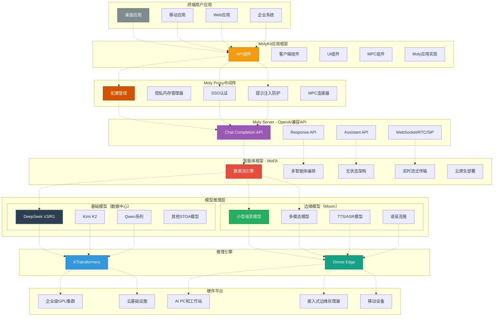

### 核心组件

| 组件                | 技术          | 主要功能               | 核心优势                             |
| ----------------- | ----------- | ------------------ | -------------------------------- |
| **KTransformers** | CPU-GPU异构引擎 | 数据中心级100B+参数模型推理   | 预填充延迟降低30倍，生成速度提升3倍，MoE优化        |
| **Moxin AI**      | 边缘优化模型      | 实时对话AI（TTS/ASR/语音） | 亚秒级响应，多模态，跨平台                    |
| **MoFA**          | 数据流驱动智能体框架  | 多智能体编排和应用逻辑        | 无状态架构，线性扩展，云原生部署                 |
| **Moly Server**   | OpenAI兼容API | 模型访问的API网关         | OpenAI即插即用替代，支持WebSocket/RTC/SIP |
| **MolyKit**       | Rust应用框架    | 跨平台AI应用开发          | 单一代码库支持桌面/移动/Web，高性能，内存安全        |
| **Moly Proxy**    | 中间件层        | 安全配置和认证            | SSO，隐私管理，提示注入防护                  |

---

## 第一层：基础模型与推理引擎

### 1.1 KTransformers上的数据中心模型

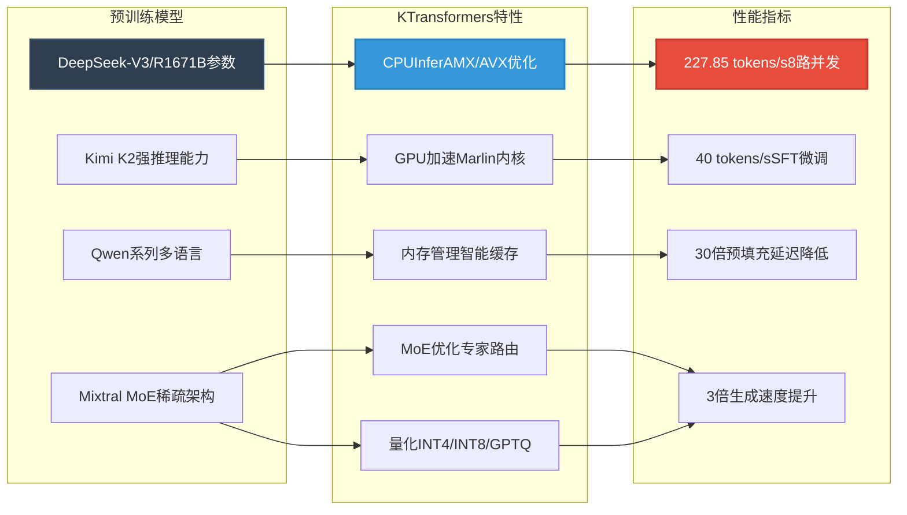

#### 核心特性

- **异构计算**：智能CPU-GPU调度实现最优资源利用
- **MoE优化**：先进的专家放置和路由，支持混合专家模型
- **超低延迟**：AMX/AVX优化内核使预填充延迟降低30倍
- **内存高效**：支持在单GPU上运行671B参数模型，支持CPU卸载
- **企业级**：生产就绪，集成SGLang，支持热/冷专家管理

#### 部署场景

- **企业助手**：安全的本地AI助手，用于代码生成和分析
- **研究计算**：使用70GB GPU + 1.3TB RAM微调大型模型
- **多租户服务**：支持8路并行生成的并发请求处理
- **行业解决方案**：媒体、安全、金融等需要大模型能力的应用

### 1.2 Omnix引擎上的边缘模型

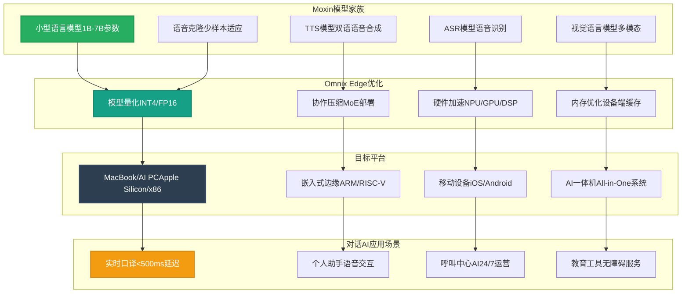

#### 核心特性

- **实时性能**：对话AI应用的亚秒级响应
- **跨平台**：单模型运行在macOS、Linux、Windows、iOS、Android、HarmonyOS
- **隐私保护**：设备端处理，无需依赖云端
- **多模态**：集成的视觉、语音和语言理解
- **成本效益**：针对消费级硬件优化，无需昂贵GPU

#### 应用场景

- **实时口译**：带自然语音输出的即时语言翻译
- **语音交互**：应用和设备的自然语言界面
- **AI一体机**：用于教育、无障碍、公共服务的智能设备
- **离线运行**：需要本地处理的关键任务应用

---

## 第二层：MoFA智能体框架

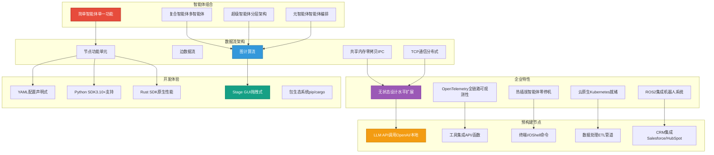

### 架构亮点

#### 无状态设计

- **水平扩展**：增加实例带来线性性能提升
- **容错性**：单个智能体故障不影响系统稳定性
- **负载均衡**：请求分发到可用资源
- **会话管理**：持久化工作流的外部状态存储

#### 数据流驱动执行

- **可组合性**：智能体像乐高积木一样堆叠创建复杂行为
- **流式传输**：智能体间的全双工实时数据流
- **零拷贝IPC**：本地部署的共享内存通信
- **分布式**：基于TCP的云和混合部署通信

#### 开发体验

- **可视化构建器**：Stage GUI支持拖拽式智能体组合
- **声明式配置**：基于YAML的智能体定义
- **多语言支持**：Python快速原型，Rust高性能
- **包生态系统**：自定义节点通过pip/cargo安装

#### 企业集成

- **可观测性**：内置OpenTelemetry用于追踪和监控
- **热重载**：无需重启系统更新智能体
- **工具生态**：预构建节点支持CRM、数据库、API等
- **机器人系统**：ROS2集成支持具身智能应用

### 应用场景

#### CRM自动化

- **线索评分**：多智能体分析客户交互
- **邮件生成**：个性化外联，语气匹配
- **会议摘要**：实时转录和行动项提取
- **管道管理**：交易进展的预测分析

#### 呼叫中心AI

- **智能分流**：基于内容和紧急程度路由呼叫
- **实时协助**：向人工代理建议回复
- **质量保证**：监控和评分代理表现
- **呼叫后工作**：自动总结和CRM更新

#### 深度研究

- **多源分析**：跨数据库和网络的并行研究
- **综合引擎**：将发现整合成连贯报告
- **引用管理**：追踪来源和验证声明
- **迭代优化**：基于用户反馈优化研究

#### 编程辅助

- **代码生成**：多文件项目脚手架
- **错误检测**：静态分析和模式识别
- **文档生成**：从代码自动生成文档
- **审查自动化**：PR分析和建议生成

---

## 第三层：Moly Server - OpenAI兼容API

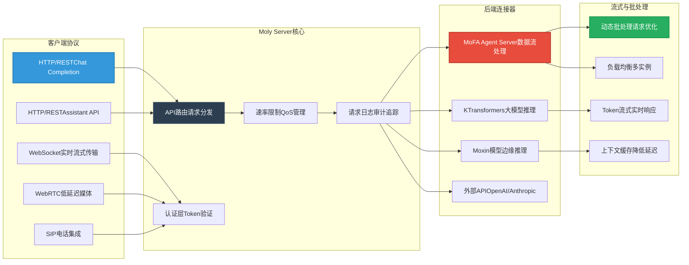

### API兼容性

#### Chat Completion API

- **OpenAI兼容**：现有应用即插即用替代
- **流式支持**：实时Token流式传输，响应迅速
- **函数调用**：工具使用和外部API集成
- **多模态**：文本、视觉和音频输入
- **上下文管理**：自动对话历史处理

#### Assistant API

- **持久化线程**：长对话管理
- **文件上传**：文档分析和RAG集成
- **工具集成**：内置和自定义工具支持
- **运行管理**：可配置执行参数
- **事件流式**：实时状态更新

#### 实时协议

- **WebSocket**：聊天和语音的双向流式传输
- **WebRTC**：超低延迟的音视频通话
- **SIP集成**：企业电话系统连接
- **全双工**：同时发送和接收能力

### 性能优化

#### 动态批处理

- **请求合并**：将相似请求分组以提高处理效率
- **自适应批大小**：根据模型和硬件能力调整
- **优先级队列**：确保低延迟请求优先处理

#### Token流式传输

- **实时响应**：生成时立即发送Token，非批量处理
- **降低TTFB**：首字节时间低于100ms
- **渐进显示**：用户看到响应逐步构建

#### 上下文缓存

- **KV缓存复用**：在相似请求间共享缓存状态
- **会话持久化**：在多次交互中保持上下文
- **内存优化**：高效的缓存淘汰策略

---

## 第四层：MolyKit - 跨平台AI应用框架

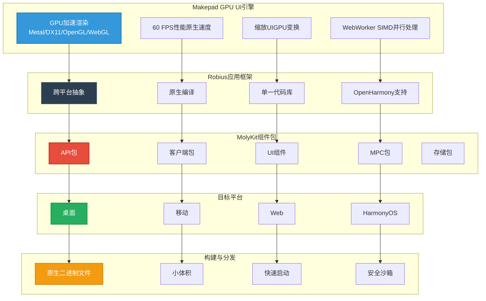

### 开发体验

#### Rust原生栈

- **内存安全**：消除整类错误（缓冲区溢出、释放后使用）
- **零成本抽象**：高级代码，C级性能
- **并发安全**：所有权模型支持无畏并发
- **小型二进制文件**：紧凑可执行文件，快速下载更新

#### GPU加速UI

- **60 FPS**：所有平台流畅动画和交互
- **GPU缩放**：无损无缝缩放
- **SIMD WebWorkers**：计算密集型任务并行处理
- **原生性能**：直接GPU访问，无中间层

#### 跨平台一致性

- **单一代码库**：一次编写，桌面/移动/Web运行
- **原生外观**：平台特定主题和行为
- **功能对等**：所有平台相同能力
- **统一测试**：核心逻辑测试一次，UI按平台验证

### 组件架构

#### API包

- **OpenAI兼容性**：OpenAI应用即插即用客户端
- **MoFA集成**：直接连接智能体框架
- **本地模型**：边缘部署的直接推理
- **混合路由**：云端和本地间的自动故障转移

#### UI组件

- **聊天界面**：支持markdown和媒体的富消息
- **代码编辑器**：语法高亮和智能补全
- **工具面板**：可扩展插件的模块化UI
- **语音界面**：实时音频可视化和控制

#### 隐私与MPC包

- **设备端处理**：敏感数据本地保留
- **安全区域**：密钥和数据的硬件级保护
- **多方计算**：不共享数据的协作计算
- **差分隐私**：数据保护的统计保证

#### 存储包

- **本地缓存**：离线优先数据持久化
- **云端同步**：无缝跨设备同步
- **向量数据库**：RAG应用的本地嵌入
- **加密备份**：客户端加密的安全云存储

### 目标应用

#### 1. AI聊天客户端

- **多提供商**：OpenAI、本地和企业模型间切换
- **富媒体**：支持图片、音频和文档
- **对话管理**：文件夹、搜索和组织
- **协作**：共享对话和提示

#### 2. 代码开发

- **IDE集成**：VS Code、JetBrains和独立编辑器
- **智能补全**：上下文感知代码建议
- **文档生成**：从代码自动生成文档
- **代码审查**：AI驱动的PR分析

#### 3. 企业应用

- **CRM界面**：AI增强的客户关系管理
- **呼叫中心UI**：实时代理协助
- **报告生成**：自动化文档创建
- **工作流自动化**：自定义业务流程智能体

#### 4. 创意工具

- **内容生成**：营销文案、博客文章、社交媒体
- **设计辅助**：UI/UX建议和代码生成
- **视频脚本**：故事板和脚本编写
- **翻译**：实时多语言支持

---

## Moly Proxy - 企业中间件

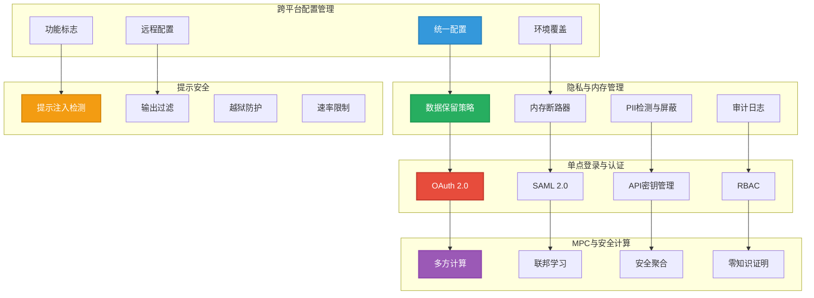

### 配置管理

#### 统一配置系统

- **单一事实来源**：所有组件配置一致
- **多格式支持**：JSON、YAML、TOML，基于团队偏好
- **环境层级**：从基础继承，按环境覆盖
- **验证**：模式验证防止配置错误
- **版本控制**：Git追踪配置的变更历史

#### 动态配置

- **远程更新**：无需重新部署即可更改配置
- **功能标志**：渐进式发布和A/B测试
- **紧急开关**：即时禁用有问题的功能
- **配置UI**：非技术管理员Web界面

### 隐私与安全

#### 数据治理

- **保留策略**：基于访问时间自动删除
- **区域合规**：符合GDPR、CCPA、HIPAA的数据处理
- **匿名化**：PII检测和自动屏蔽
- **加密**：传输中和静态数据的端到端加密

#### 内存安全

- **断路器**：防止OOM崩溃，优雅降级
- **配额管理**：按用户和租户内存限制
- **GC优化**：针对AI工作负载调整垃圾收集
- **资源监控**：实时内存和CPU追踪

#### 认证与授权

- **SSO集成**：企业身份提供商（Azure AD、Okta、Auth0）
- **多因素认证**：支持TOTP、WebAuthn、SMS
- **API密钥管理**：带权限的限定范围Token
- **会话管理**：安全、可撤销的会话
- **RBAC**：细粒度基于角色的访问控制

#### 提示安全

- **注入检测**：提示注入尝试的模式匹配
- **越狱防护**：加固的系统提示和输入验证
- **输出过滤**：内容审核和安全过滤
- **速率限制**：防止滥用，请求节流
- **监控**：可疑模式和异常警告

### 多方计算

#### 隐私保护AI

- **协作推理**：多方计算不共享数据
- **联邦学习**：分布式数据集训练模型
- **安全聚合**：加密保证结果组合
- **零知识证明**：验证计算不泄露输入

#### 应用场景

- **医疗**：无需共享数据的多机构研究
- **金融**：不暴露客户数据的跨银行欺诈检测
- **供应链**：不泄露商业机密的协作规划
- **跨组织AI**：保护隐私的共享智能

---

## 部署架构

### 1. 本地企业部署

```mermaid
graph TB
    subgraph "企业网络"
        U[用户员工/客户]
        LB[负载均衡器]
        FW[防火墙IDS/IPS]
    end

    subgraph "应用层"
        MK[MolyKit应用桌面/移动]
        MP[Moly Proxy认证与安全]
        MS[Moly ServerAPI网关]
        MF[MoFA智能体业务逻辑]
    end

    subgraph "AI基础设施"
        subgraph "KTransformers集群"
            KT1[KTransformers节点1]
            KT2[KTransformers节点2]
            KT3[KTransformers节点3]
        end
        subgraph "Moxin边缘"
            ME1[边缘服务器1AIPC/MacBook]
            ME2[边缘服务器2AIPC/MacBook]
        end
    end

    subgraph "存储与数据"
        DB[]
        CACHE[]
        OBJ[]
        VDB[]
    end

    U --> FW
    FW --> LB
    LB --> MK
    MK --> MP
    MP --> MS
    MS --> MF

    MF --> KT1
    MF --> ME1
    MF --> ME2

    KT1 --> DB
    KT2 --> CACHE
    KT3 --> OBJ
    ME1 --> VDB
    ME2 --> VDB

    style U fill:#7f8c8d,stroke:#707b7c,stroke-width:2px,color:#fff
    style LB fill:#3498db,stroke:#2980b9,stroke-width:2px,color:#fff
    style MK fill:#2c3e50,stroke:#34495e,stroke-width:2px,color:#fff
    style KT1 fill:#e74c3c,stroke:#c0392b,stroke-width:2px,color:#fff
    style ME1 fill:#27ae60,stroke:#229954,stroke-width:2px,color:#fff
    style DB fill:#9b59b6,stroke:#8e44ad,stroke-width:2px,color:#fff
```

#### 优势

- **数据主权**：完全控制数据和模型
- **合规性**：满足法规要求（GDPR、HIPAA、SOC2）
- **性能**：企业网络内低延迟访问
- **定制化**：针对特定需求定制模型和智能体
- **成本可预测性**：固定基础设施成本 vs 按使用付费

### 2. 混合云部署

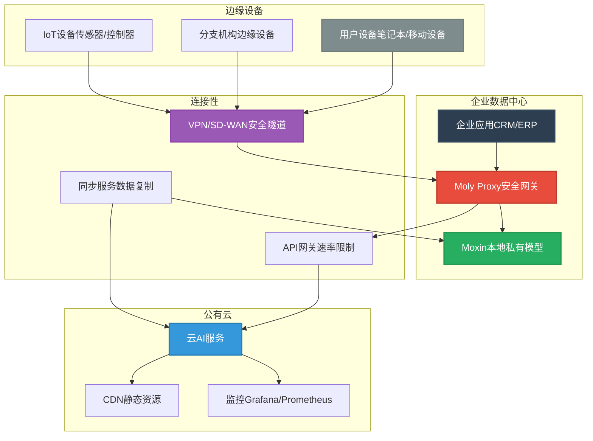

#### 优势

- **可扩展性**：峰值需求时扩展到云端
- **成本优化**：本地运行基线，按需扩展到云
- **灵活性**：基于工作负载选择部署位置
- **灾难恢复**：云作为本地故障的备份
- **全球覆盖**：从最近的云区域服务用户

### 3. 边缘优先分布式部署

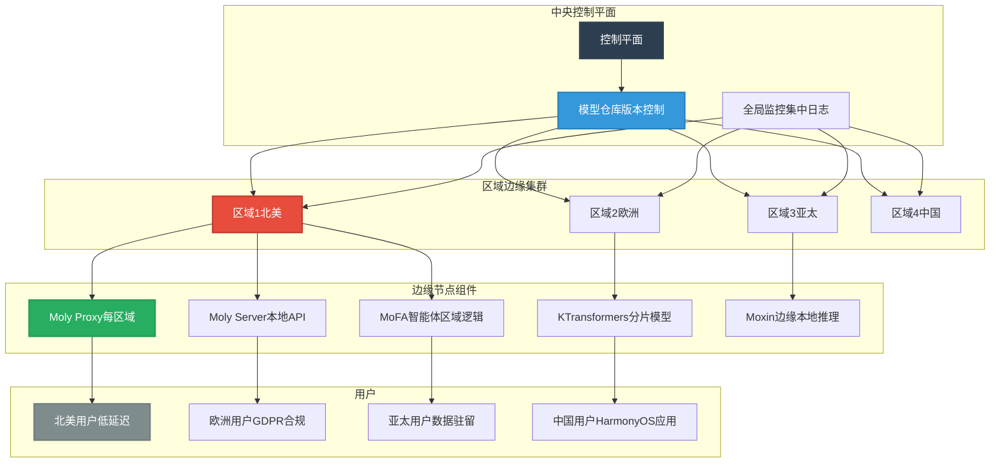

#### 优势

- **低延迟**：从地理最近位置服务用户
- **数据驻留**：将数据保留在特定区域以满足合规
- **离线运行**：网络分区时继续工作
- **带宽减少**：本地处理数据，仅发送元数据
- **可扩展性**：边缘水平扩展降低中心负载

---

## 性能基准

### 推理性能

| 模型               | 框架            | 硬件            | 吞吐量             | 延迟    | 内存                   |
| ---------------- | ------------- | ------------- | --------------- | ----- | -------------------- |
| DeepSeek-R1 0528 | KTransformers | 8×L20 + Xeon  | 227.85 tokens/s | 50ms  | 1.3TB RAM            |
| DeepSeek-V3 671B | KTransformers | 单GPU + CPU    | 40 tokens/s     | 100ms | 70GB GPU + 1.3TB RAM |
| Moxin 7B         | Omnix Edge    | MacBook M3    | 120 tokens/s    | 20ms  | 16GB Unified         |
| Moxin 1B         | Omnix Edge    | iPhone 15 Pro | 80 tokens/s     | 30ms  | 8GB On-Device        |

### 应用性能

| 指标     | MolyKit | Electron | React Native | Native |
| ------ | ------- | -------- | ------------ | ------ |
| 二进制大小  | 25 MB   | 150 MB   | 45 MB        | 15 MB  |
| 启动时间   | 0.8s    | 3.2s     | 1.5s         | 0.5s   |
| 内存使用   | 180 MB  | 450 MB   | 280 MB       | 150 MB |
| UI FPS | 60 FPS  | 45 FPS   | 55 FPS       | 60 FPS |
| 跨平台    | 是       | 是        | 是            | 否      |

### 智能体框架性能

| 配置       | 请求/秒  | P95延迟 | 扩展系数  |
| -------- | ----- | ----- | ----- |
| 1个智能体实例  | 50    | 200ms | 1×    |
| 4个智能体实例  | 195   | 210ms | 3.9×  |
| 16个智能体实例 | 780   | 220ms | 15.6× |
| 64个智能体实例 | 3,120 | 250ms | 62.4× |

---

## 安全架构

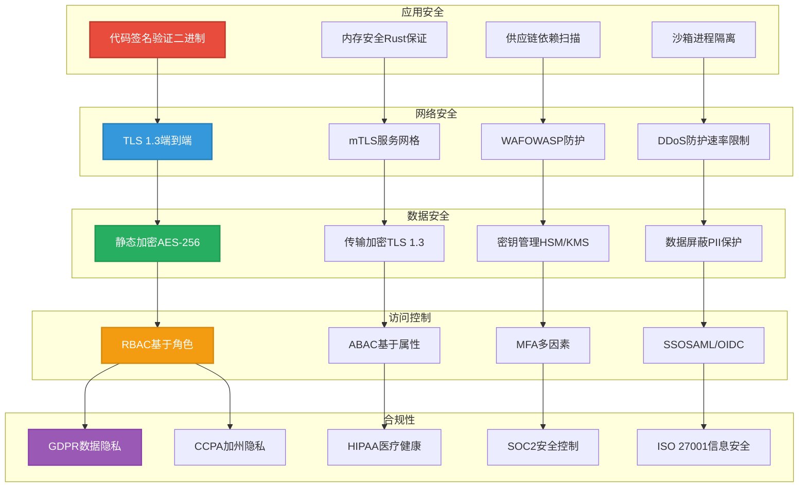

### 安全层级

#### 1. 基础设施安全

- **网络分段**：将AI工作负载与企业网络隔离
- **零信任架构**：验证每个访问请求
- **入侵检测**：实时监控和警告
- **漏洞管理**：自动化扫描和修补

#### 2. 模型安全

- **模型签名**：验证模型完整性和来源
- **访问控制**：限制授权服务访问模型
- **使用监控**：追踪模型调用并检测异常
- **模型水印**：在生成内容中嵌入可追溯性

#### 3. 数据安全

- **加密**：静态AES-256，传输中TLS 1.3
- **Token化**：用Token替换敏感数据
- **差分隐私**：添加统计噪声保护个体数据
- **数据防泄露**：防止敏感信息外泄

#### 4. 应用安全

- **输入验证**：消毒所有用户输入
- **输出过滤**：审核模型响应
- **速率限制**：防止滥用，确保公平使用
- **审计日志**：全面活动追踪

### 合规框架

#### 数据驻留

- **区域部署**：将数据保留在特定地理区域
- **数据分类**：基于敏感度标记和处理数据
- **保留策略**：基于法规自动删除
- **访问日志**：追踪所有数据访问以满足合规报告

#### 隐私设计

- **最小数据收集**：仅收集必要信息
- **目的限制**：仅将数据用于声明目的
- **用户同意**：细粒度同意管理
- **删除权**：遵从用户数据删除请求

---

## 运维自动化

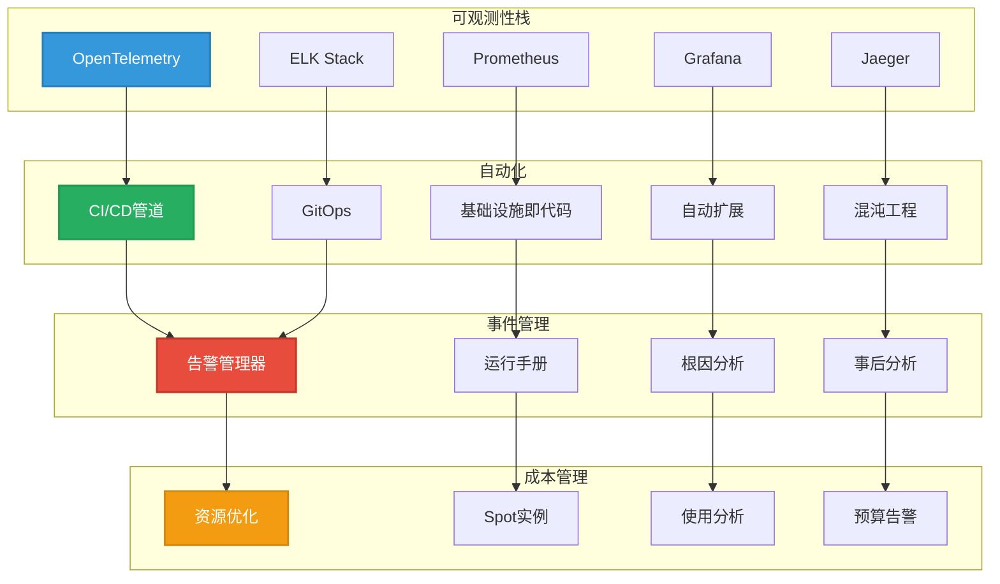

### 监控与可观测性

#### 指标收集

- **基础设施**：CPU、内存、磁盘、网络利用率
- **应用**：请求率、延迟、错误率、饱和度
- **模型性能**：Tokens/秒、队列深度、缓存命中率
- **业务指标**：活跃用户、对话量、任务完成率

#### 分布式追踪

- **端到端可见性**：追踪所有服务的请求
- **性能瓶颈**：识别慢组件
- **依赖映射**：理解服务交互
- **错误传播**：追踪系统中的错误

#### 日志策略

- **结构化日志**：JSON日志便于解析
- **日志级别**：Debug、info、warn、error、fatal
- **关联ID**：跨分布式系统追踪请求
- **敏感数据屏蔽**：自动PII删除

### 自动化

#### CI/CD管道

- **自动化测试**：单元、集成和端到端测试
- **模型验证**：性能和准确性回归测试
- **安全扫描**：SAST、DAST、依赖漏洞检查
- **多环境**：Dev、Staging、Production，带晋级门槛

#### 基础设施即代码

- **声明式配置**：版本控制基础设施
- **可复现环境**：开发环境设置一致
- **自动化编排**：按需资源创建
- **灾难恢复**：自动化故障转移和恢复

#### 自动扩展

- **水平Pod自动扩展器**：基于CPU/内存扩展
- **KEDA**：基于自定义指标扩展（队列长度、请求/秒）
- **预测性扩展**：基于ML的容量规划
- **成本感知扩展**：平衡性能和成本

### 事件响应

#### 告警

- **多渠道**：Slack、邮件、SMS、PagerDuty
- **智能分组**：相关告警分组为事件
- **升级策略**：如未确认自动升级
- **值班调度**：公平轮班，支持覆盖

#### 运行手册自动化

- **自愈**：已知问题的自动化修复
- **ChatOps**：从Slack/Teams触发操作
- **决策树**：引导式故障排除工作流
- **事后分析**：自动化事件时间线生成

---

## 对比矩阵

### vs. 专有解决方案

| 特性        | Moxin-Org | OpenAI     | Anthropic  | Azure AI   | AWS Bedrock |
| --------- | --------- | ---------- | ---------- | ---------- | ----------- |
| **开源**    | ✅ 100%    | ❌ 否        | ❌ 否        | ❌ 否        | ❌ 否         |
| **本地部署**  | ✅ 完整      | ❌ 有限       | ❌ 有限       | ✅ 是        | ✅ 是         |
| **自定义模型** | ✅ 无限      | ❌ 限制       | ❌ 限制       | ✅ 有限       | ✅ 有限        |
| **边缘部署**  | ✅ 全栈      | ❌ 仅限API    | ❌ 仅限API    | ❌ 有限       | ❌ 有限        |
| **成本**    | 💰 基础设施   | 💰💰💰 按使用 | 💰💰💰 按使用 | 💰💰💰 按使用 | 💰💰💰 按使用  |
| **数据控制**  | ✅ 完全      | ❌ 共享       | ❌ 共享       | ✅ 私有       | ✅ 私有        |
| **智能体框架** | ✅ 高级      | ❌ 基础       | ❌ 基础       | ✅ 有限       | ✅ 有限        |
| **跨平台应用** | ✅ 完整      | ❌ 无        | ❌ 无        | ❌ 无        | ❌ 无         |

### vs. 开源替代方案

| 特性        | Moxin-Org       | Llama.cpp   | Ollama   | LangChain | Hugging Face   |
| --------- | --------------- | ----------- | -------- | --------- | -------------- |
| **模型服务**  | ✅ KTransformers | ✅ llama.cpp | ✅ Ollama | ❌ 无       | ✅ 推理           |
| **边缘推理**  | ✅ Moxin/Omnix   | ⚠️ 有限       | ✅ 是      | ❌ 无       | ⚠️ 部分          |
| **智能体框架** | ✅ MoFA          | ❌ 无         | ❌ 无      | ✅ 是       | ✅ Transformers |
| **应用框架**  | ✅ MolyKit       | ❌ 无         | ❌ 无      | ⚠️ 部分     | ❌ 无            |
| **API网关** | ✅ Moly Server   | ❌ 无         | ⚠️ 基础    | ❌ 无       | ⚠️ 部分          |
| **中间件**   | ✅ Moly Proxy    | ❌ 无         | ❌ 无      | ❌ 无       | ❌ 无            |
| **跨平台**   | ✅ 完整            | ❌ 无         | ⚠️ 桌面    | ❌ 无       | ❌ 无            |
| **集成**    | ✅ 端到端           | ⚠️ 手动       | ⚠️ 手动    | ⚠️ 复杂     | ⚠️ 手动          |

---

## 快速开始

### 快速启动：本地开发

```bash
# 克隆仓库
git clone https://github.com/kvcache-ai/ktransformers
git clone https://github.com/moxin-org/moly
git clone https://github.com/mofa-org/mofa
git clone https://github.com/moxin-org/moxin-llm

# 安装依赖
cd ktransformers && pip install -e .
cd ../moly && cargo build --release
cd ../mofa && pip install -e .

# 启动服务
./moly-server --config config/local.toml
./mofa-agent-server --port 8000

# 运行Moly客户端
./moly --server http://localhost:8000
```

### 企业部署

```bash
# 使用Kubernetes部署
helm repo add moxin-org https://helm.moxin.org
helm install moly-suite moxin-org/moly-suite \
  --set inference.engine=ktransformers \
  --set agent.framework=mofa \
  --set replicaCount=3

# 配置Moly Proxy
kubectl create configmap moly-config \
  --from-file=config/production.yaml

# 暴露服务
kubectl apply -f ingress/moly-ingress.yaml
```

### 构建自定义应用

```rust
// 示例：使用MolyKit的自定义AI应用
use molykit::prelude::*;
use molykit::widgets::{ChatWindow, ModelSelector};

#[main]
fn main() {
    let mut app = Application::new();

    // 配置API客户端
    let client = ApiClient::new("http://moly-server:8000")
        .with_api_key(env!("MOLY_API_KEY"));

    // 添加聊天界面
  proxy
  app.add_window(ChatWindow::new(client));

    // 添加模型选择器
    app.add_toolbar(ModelSelector::new());

    // 运行跨平台应用
    app.run();
}
```

---

## 社区与支持

### 开源生态

Moxin-Org平台建立在开源协作基础之上：

- **280+社区成员**积极贡献ANP协议
- **每周迭代**持续改进
- **开放标准**实现互操作性和供应商中立
- **教育资源**包括课程、教程和文档

### 企业支持

- **商业支持**：SLA和专业技术支持
- **专业服务**：架构审查和实施协助
- **培训项目**：团队研讨会和认证
- **定制开发**：定制功能和集成

### 贡献

我们欢迎社区贡献：

- **代码贡献**：向我们的GitHub仓库提交PR
- **文档**：改进文档和编写教程
- **错误报告**：帮助我们识别和修复问题
- **功能请求**：提出新功能

---

## 路线图

### 2025年第一季度

- **增强MoFA IDE**：带调试的可视化智能体构建器
- **MolyKit v2.0**：改进UI组件和性能
- **KTransformers v2.0**：支持下一代模型架构
- **Omnix Edge**：扩展硬件平台支持

### 2025年第二季度

- **企业特性**：高级RBAC和审计能力
- **多云**：原生支持AWS、Azure、GCP
- **联邦学习**：隐私保护的协作训练
- **移动优化**：增强iOS和Android性能

### 2025年第三季度

- **视频理解**：Moxin模型中的原生视频处理
- **高级工具使用**：复杂多步智能体工作流
- **量化**：2-bit和1-bit模型压缩
- **硬件加速**：NPU和AI芯片优化

### 2025年第四季度

- **自治智能体**：自我改进的智能体系统
- **多智能体市场**：智能体间商业和协作
- **边缘训练**：设备端模型微调
- **量子准备**：后量子加密集成

---

## 结论

Moxin-Org企业级AI解决方案代表了组织构建、部署和运营AI应用的范式转变。通过提供从边缘设备到数据中心的完整开源栈，我们使企业能够：

- **保持控制**：完全拥有数据、模型和基础设施
- **确保隐私**：本地和边缘部署选项
- **实现性能**：优化的推理引擎和跨平台框架
- **加速开发**：可组合的智能体和跨平台UI工具包
- **降低成本**：消除供应商锁定和按使用付费
- **面向未来**：开放标准和活跃社区开发

无论您构建的是客户服务聊天机器人、代码生成助手、多模态研究工具还是AI驱动的CRM，Moxin-Org平台都为您在AI原生未来取得成功提供所需基础。

**立即开始：https://github.com/moxin-org**

---

*🤖 使用[Claude Code](https://claude.com/claude-code)为Moxin-Org生成*

*共同作者：Moxin社区*
